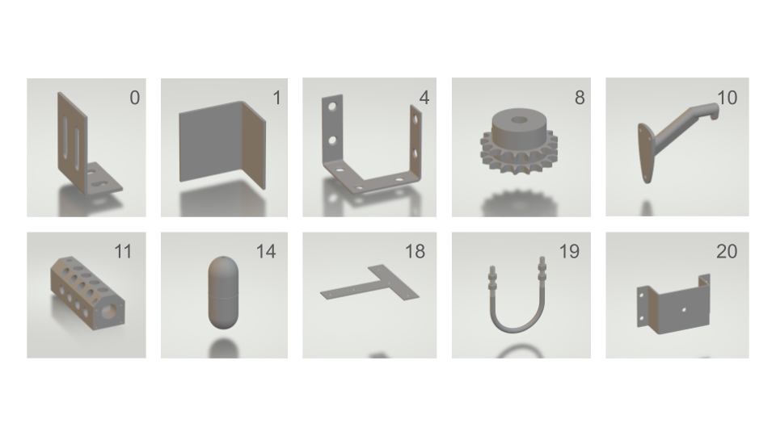

## 6D detection on IPD (Industrial Plenoptic Dataset) with FoundationPose
<p align="center">
  
</p>


### 1. Environment Setup
CUDA versions should match between GPU Driver, CUDA Toolkit and PyTorch.
```shell
conda create -n foundationpose python=3.10
conda activate foundationpose
conda install cuda=12.4
pip install torch==2.6.0 torchvision==0.21.0 --index-url https://download.pytorch.org/whl/cu124
pip install -r requirements.txt
```
Data should follow the structure:
```
FOUNDATIONPOSE-IPD
|---Data/
|   |---IPD/
|       |---models/
|       |---camera_[cam1, cam2, cam3, photoneo].json
|       |---camera_phononeo.json
|       |---ism_mask_sam6d.json
|       |---test_targets_bop19.json
|       |---test/
|           |---000000/
|                |---aolp_[cam1, cam2, cam3]/
|                |---depth_[cam1, cam2, cam3, photoneo]/
|                |---dolp_[cam1, cam2, cam3]/
|                |---rgb_[cam1, cam2, cam3, photoneo]/
|                |---scene_camera_[cam1, cam2, cam3, photoneo].json
|           |---000001/
|           |---...
|           |---000014/
```

### 2. Evaluation on the IPD dataset

```shell
python run_inference.py --dataset_dir Data/IPD --use_reconstructed_mesh 0 --mask_dir Data/IPD/ism_mask_sam6d.json --debug 1 --debug_dir debug --test_targets_path Data/IPD/test_targets_bop19.json
```

<!-- ### 3. Results
Here is an example detection with ISM segmentations and PEM detections concatenated with the original RGB image:
<p align="center">
  
</p>
<p align="center">
  
</p> -->